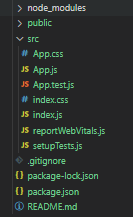

# ReactTrek
**My trek thru React, teach myself how to use React with project**

## Setup React Environment
- chrome extension : [React Developer Tools](https://chrome.google.com/webstore/detail/react-developer-tools/fmkadmapgofadopljbjfkapdkoienihi)
- quick start React enviroment by [create-react-app](https://github.com/facebook/create-react-app)
  - *package.json* : Most important files defined the needed module or package of project. if you delete the mode_module, you still reinstall it back through `npm install` command.
  - *index.html* : There is not too much html. Most of the html is gernerated by component. 
  - *index.js* : The file renders component to index.html.  
  - *App.js* : example of component. 
  - *App.test.js* : Testing code of App.js. ( Note: Files with `.test.js` suffix.)
  
  

    
  

## Project Purpose
- Be familiar with React Hook by practicing mini project
- Some project will also use popluar React packages, tools like `React Router6`, `Axios`, `Redux and so on.
- Learning Testing by my partial finished project.

## Some Rule of Hooks and components
 + Component must be uppercase of first letter
 + Hooks starts with useXXX
 + Hooks Invoke inside function/component body
 + Don't call hooks conditonally ( ex: write useEffect in if statement) 

## Project list
1. [Slider][1]
2. [Quiz][2]
3. [Unsplash Gallery][3]
4. [Cocktail Gallery][4]
5. [To List][5]
6. [Weather Observation][6]

[1]: https://github.com/jasonLuFa/ReactTrek/tree/main/01-slider
[2]: https://github.com/jasonLuFa/ReactTrek/tree/main/02-quiz
[3]: https://github.com/jasonLuFa/ReactTrek
[4]: https://github.com/jasonLuFa/ReactTrek
[5]: https://github.com/jasonLuFa/ReactTrek
[6]: https://github.com/jasonLuFa/ReactTrek

